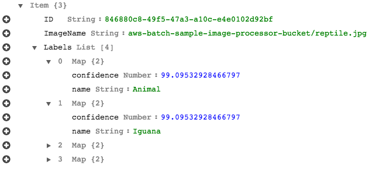

# aws-batch-image-processor

aws-batch-image-processor is a sample project that demonstrates the use of [AWS Batch](https://aws.amazon.com/batch/). Here, we use [Amazon Rekognition](https://aws.amazon.com/rekognition/) to detect entities in a photo uploaded to [Amazon S3](https://aws.amazon.com/s3/). While this is somewhat simple use case, the job itself could be extended to handle more complex batch scenarios as well.

The sample code contains the following:

* *template.tf* - [Terraform](https://www.terraform.io/) plan containing the AWS resources required (e.g. AWS Batch Job Queue and Job Definition).
* */job* - assets to execute the batch job.
* */lambda* - [AWS Lambda](https://aws.amazon.com/lambda/) function used to submit / start the batch job.

## Getting Started

To get started, clone this repository locally:

```
$ git clone https://github.com/jkahn117/aws-batch-image-processor.git
```

### Prerequisites

To run the project, you will to:

1. Select an AWS Region. Be sure that all required services (e.g. AWS Batch, AWS Lambda) are available in the Region selected.
2. Install [Docker](https://docs.docker.com/install/).
3. Install [HashiCorp Terraform](https://www.terraform.io/intro/getting-started/install.html).
4. Install the latest version of the [AWS CLI](http://docs.aws.amazon.com/cli/latest/userguide/installing.html) and confirm it is [properly configured](http://docs.aws.amazon.com/cli/latest/userguide/cli-chap-getting-started.html#cli-quick-configuration).

## Create AWS Resources with Terraform

For this project, we will use Terraform to deploy our AWS Resources. These includes various Batch components (Compute Environnment, Job Queue, and Job Definition) as well as a Lambda function and related IAM Roles.

To [build infrastructure](https://www.terraform.io/intro/getting-started/build.html) with Terraform (be sure AWS credentials are configured with appropriate permissions):

```
# initialize the terraform environment
$ terraform init

# review the plan
$ terraform plan

# deploy...
$ terraform apply
```

## Build and Push Docker Image

Once finished, Terraform will output the name of your newly created ECR Repository, e.g. `123456789098.dkr.ecr.us-east-1.amazonaws.com/aws-batch-image-processor-sample`. Note this value as we will use it in subsequent steps (referred to as `MY_REPO_NAME`):

```
$ cd job

# build the docker image
$ docker build -t aws-batch-image-processor-sample .

# tag the image
$ docker tag aws-batch-image-processor-sample:latest <MY_REPO_NAME>:latest

# push the image to the repository
docker push <MY_REPO_NAME>:latest
```

Pushing the image may take several minutes.

## Upload an Image to S3

In addition to the repository name, Terraform will also output the name of a newly created S3 bucket (starts with "aws-batch-sample-"). We will use that name next (referred to as `MY_BUCKET_NAME`).

Select an image, perhaps of a pet or your street.

```
# upload the image to s3
$ aws s3 cp <MY_IMAGE> s3://<MY_BUCKET_NAME>
```

## Invoke Lambda to Submit Batch Job

Finally, let's invoke our Lambda function to submit a new batch job.

```
$ aws lambda invoke aws-batch-image-processor-function \
                    --payload '{"imageName": "reptile.jpg"}'
```


## Verification

Creating the compute resources to run the Batch job may require several minutes. During this time, I recommend visiting the AWS Console. A few things to review:

* AWS Batch Dashboard and Job Queue
	* Note the state of your job.
	* Submitting multiple jobs will cause your queue length to increase.
* AWS Batch Job Definition
	* Defines the batch job, note the Docker image.
	* Note the command used to initiate the job worker (written here in Ruby, but could be any language).

Once your job state is "SUCCEEDED", visit the DynamoDB console and open the `aws-batch-image-processor` table. It should contain an entry such as:



## Cleaning Up

When ready, it is easy to remove the resources created in this sample via Terraform (note that you may need to empty your S3 bucket first):

```
$ terraform destroy
```

## Authors

* **Josh Kahn** - *initial work*
